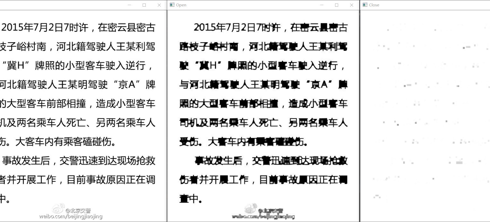

# Image-Processing-1 用于记录图像处理中的demo 
## open_close.py 用于进行图像的开闭运算腐蚀和膨胀操作
- 先腐蚀后膨胀的过程称为开运算
- 先膨胀后腐蚀的过程称为闭运算
- [博客](https://blog.csdn.net/luxialan/article/details/39481701)

## zishiyi.py 用于图像的自适应阈值处理
## tidu.py 用于图像的梯度计算处理，使用的是sobel算子，[链接](https://blog.csdn.net/lovetobelove/article/details/86618324)
## opencv利用霍夫变换检测圆形物体
- 可以利用利用霍夫变换检测圆形物体
